设计模式（单例的懒汉/饿汉、线程安全问题，装饰器模式，观察者模式，适配器模式、策略模式、迭代器模式）

# 概述

## 设计模式的六大原则

**1. 开闭原则**

- 对扩展开放，对修改关闭。
- 程序拓展时，不能修改原有的代码，实现一个热插拔的效果。
- 为了使程序的扩展性好，易于维护和升级。
- 关键步骤就是抽象化，可以使用接口和抽象类。

**2. 里氏代换原则**

- 任何基类可以出现的地方，子类一定可以出现。
- 是继承复用的基石。
- 里氏代换原则是对开闭原则的补充。基类与子类的继承关系就是抽象化的具体实现，里氏代换原则是对实现抽象化的具体步骤的规范。

**3. 依赖倒转原则**

- 针对接口编程，依赖于抽象而不依赖于具体。
- 是开闭原则的基础。

**4. 接口隔离原则**

- 使用多个隔离的接口，比使用单个接口要好。
- 降低类之间的耦合度。

**5. 最少知道原则（迪米特法则）**

- 一个实体应当尽量少地与其他实体之间发生相互作用，使得系统功能模块相对独立。

**6. 合成复用原则**

- 尽量使用合成/聚合的方式，而不是使用继承。

## 工厂模式的作用

1. **降低因为产品或工厂类改变所造成的维护工作量**
   - 对象的使用逻辑或创建逻辑发生改变时只需修改使用类或工厂类，不互相影响。
2. **防止代码重复、创建蔓延**
   - 由于某些对象的创建还需要设置一些参数及环境，将创建相关代码放到一个工厂类中，能够防止实例化类的数据和代码到处都是
3. **提高可读性**
   - 从一组工厂方法中选择一个名字意义明确的工厂方法，比从一组名称相同参数不同的构造函数中选择一个构造函数要方便很多

# 创造型模式

## 简单工厂模式(静态工厂方法模式)

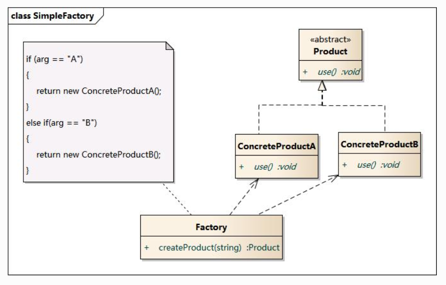

### 特点

1. 将对象的创建与对象的使用过程分离。
2. 根据参数的不同返回不同类的实例
3. 通过引入配置文件，可以在不修改代码的情况下更换具体产品类，提高了系统的灵活性。

### 缺点

1. 在于工厂类不够灵活，增加新的具体产品需要修改工厂类的判断逻辑代码，
2. 产品较多时，工厂方法代码将会非常复杂。

### 三个角色：

1. 工厂：负责生产；
2. 抽象产品：负责接口；
3. 具体产品：负责具体实现。

### 适用情况

1. 工厂类负责创建的对象比较少；
2. 客户端只知道传入工厂类的参数，对于如何创建对象不关心。

## 工厂方法模式（工厂模式）

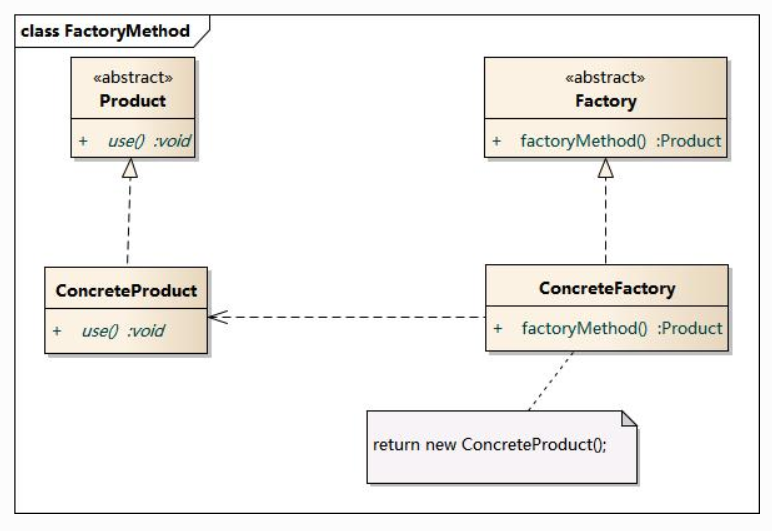

### 特点

1. 通过工厂子类来确定究竟应该实例化哪一个具体产品类。
2. 增加新产品类无须修改现有系统，封装了创建细节，有良好的灵活性和可扩展性；

### 缺点

1. 新产品需要新工厂，类个数成对增加，一定程度上增加了系统的复杂性。

### 四个角色

1. 抽象产品：是定义产品的接口；
2. 具体产品：实现了抽象产品接口；
3. 抽象工厂：声明了工厂方法；
4. 具体工厂：实现了抽象工厂中定义的工厂方法。

### 适用情况

1. 一个类不知道它所需要的对象的类；只需要知道所对应的工厂即可
2. 一个类通过其子类来指定创建哪个对象；
3. 将创建对象的任务委托给多个工厂子类中的某一个，客户端在使用时可以无须关心是哪一个工厂子类创建产品子类，需要时再动态指定。

##  抽象工厂模式(Abstract Factory)

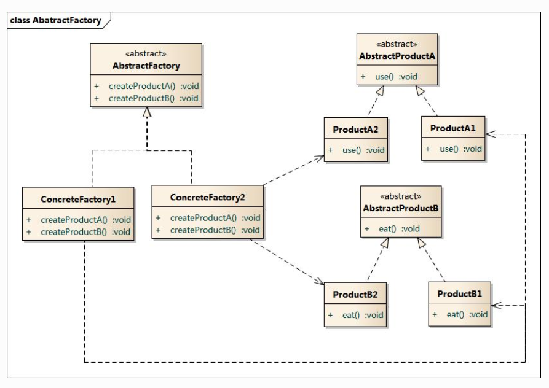

### 特点

1. 所有形式的工厂模式中最为抽象和最具一般性的一种形态。
2. 提供一个创建一系列**相关或相互依赖**对象的接口，而无须指定它们具体的类。
3. 工厂方法模式针对的是一个产品等级结构，而抽象工厂模式则需要面对多个产品等级结构。
4. 能够保证客户端始终只使用同一个产品族中的对象。	
5. 增加新的具体工厂和产品族很方便，无须修改已有系统，符合“开闭原则”。

### 缺点

1. 增加新的产品等级结构很复杂，需要修改抽象工厂和所有的具体工厂类，对“开闭原则”的支持呈现倾斜性。

### 四个角色

1. 抽象工厂：声明生成抽象产品的方法；
2. 具体工厂：实现了抽象工厂声明的生成抽象产品的方法，生成一组构成一个产品族具体产品，每一个产品都位于某个产品等级结构中；
3. 抽象产品：为每种产品声明接口；
4. 具体产品：实现抽象产品接口中定义的业务方法。

### 适用情况

1. 系统中有多于一个的产品族，而每次只使用其中某一产品族；
2. 属于同一个产品族的产品将在一起使用；

## 建造者模式

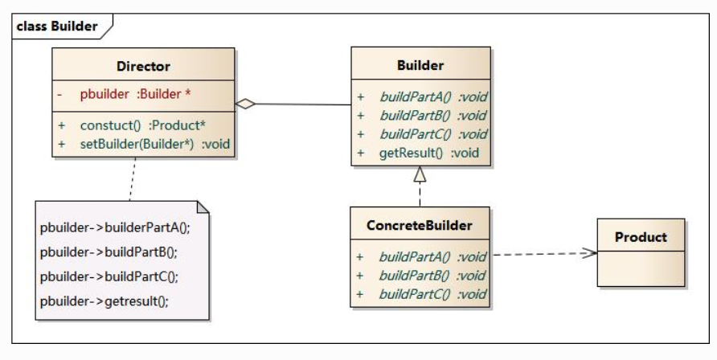

### 特点

1. 将产品复杂的创建过程与产品本身解耦。
2. 相同的创建过程，不同建造者，即可以创建不同的产品对象
3. 建造者之间相互独立，便于替换或增加具体建造者；
4. 可以更加精细地控制产品的创建过程
5. 指挥者类作用：隔离了客户与生产过程、控制产品的生成过程。

### 缺点

1. 由于其产品的组成部分一般较为相似，因此其使用范围受到一定的限制；
2. 如果产品的内部变化复杂，则需要具体建造者类来实现这种变化，导致系统变得很庞大。

### 四个角色

1. 抽象建造者：为创建一个产品对象的各个部件指定抽象接口；
2. 具体建造者：实现了抽象建造者接口，也可以提供一个方法返回创建好的复杂产品对象；
3. 产品角色：被构建的复杂对象，包含多个组成部件；
4. 指挥者：安排复杂对象的建造次序，调用建造者的部件构造与装配方法，构造复杂对象。

### 适用情况

1. 产品对象内部结构复杂，通常包含多个成员属性；
2. 产品对象的属性相互依赖，需要指定其生成顺序；
3. 要求相同的创建过程可以创建不同类型的产品。

## 单例模式

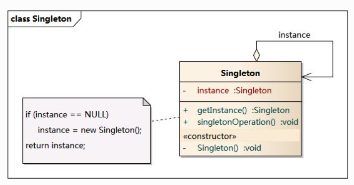

### 特点

1. 确保某一个类只有一个实例
2. 自行实例化并向整个系统提供这个实例
3. 提供全局访问的方法。
4. 提供了对唯一实例的受控访问并可以节约系统资源

### 缺点

1. 缺少抽象层而难以扩展
2. 单例类职责过重，不符合“单一职责”原则。

### 一个单例角色

1. 私有构造函数：确保用户无法通过new关键字直接实例化它；
2. 静态私有成员变量：保存它的唯一实例；
3. 静态公有工厂方法：检验实例的存在性并实例化自己，以确保只有一个实例被创建。

### 适用情况

1. 系统只需要一个实例对象；
2. 实例只允许使用一个公共访问点。

# 结构型模式

## 适配器模式

### 两种实现方式

1. **对象适配器**：依赖实现，适配器类继承了目标抽象类并定义了一个适配者类的对象实例

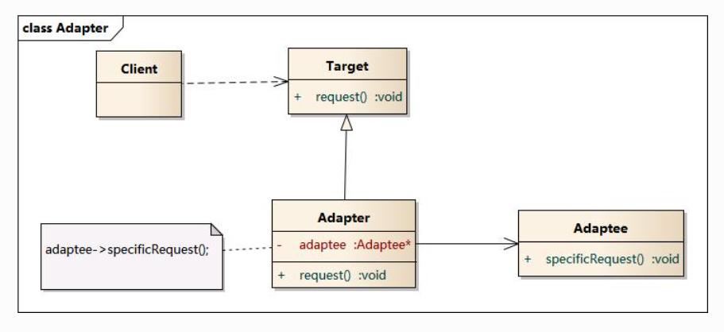

2. **类适配器**：继承实现，适配器类实现了目标抽象类接口并继承了适配者类

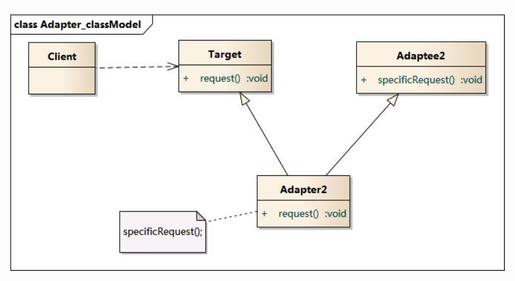

### 特点

1. 将一个接口转换成客户希望的另一个接口，使接口不兼容的那些类可以一起工作。

2. 两种实现方式：既可以作为类结构型模式，也可以作为对象结构型模式。

3. 继承目标抽象类，并在其接口的实现方法中调用适配者类的方法；

4. 将目标类和适配者类解耦，增加了类的透明性和复用性，同时系统的灵活性和扩展性都非常好；

### 缺点

1. 类适配器：很多编程语言不允许多继承；

2. 对象适配器：很难置换适配者类的方法。

### 四个角色

1. 目标抽象类：定义客户要用的特定领域的接口；

2. 适配者类：被适配的角色，它定义了一个已经存在的接口，这个接口需要适配；

3. 适配器类对适配者类进行包装适配，以满足目标抽象类的接口要求，是适配器模式的核心；

4. 客户类：调用在目标抽象类中定义的业务方法。

### 适用情况

1. 系统需要使用现有的类，而这些类的接口不符合系统的需要；

2. 想要建立一个可以重复使用的类，用于与一些彼此之间没有太大关联的一些类一起工作。

## 桥接模式

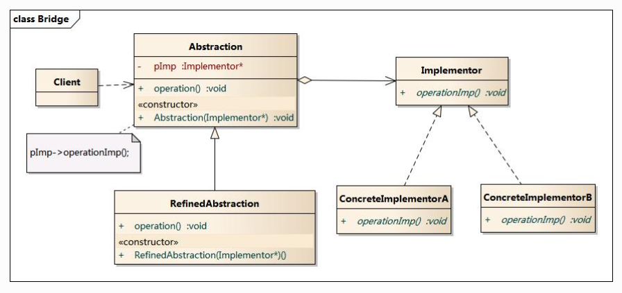

### 特点

1. 分离抽象接口及其实现部分，使它们都可以独立地变化，是比多继承方案更好的解决方法
2. 还提高了系统的可扩充性，在两个变化维度中任意扩展一个维度，都不需要修改原有系统

### 缺点

1. 增加系统的理解与设计难度，识别出系统中两个独立变化的维度不容易。

### 四个角色

1. 抽象类：定义抽象类的接口，拥有实现类接口类型的成员变量；
2. 扩充抽象类：扩充由抽象类定义的接口，实现在抽象类中定义的抽象业务方法，
3. 实现类接口：定义了实现类的接口，仅提供基本操作，而抽象类接口操作可能更多更复杂；
4. 具体实现类：实现了实现类接口，不同的具体实现类提供基本操作的不同实现

### 适用情况

1. 一个类存在两个及以上独立变化的维度，且些维度都需要进行扩展；
2. 抽象化角色和实现化角色可以以继承的方式独立扩展而互不影响；
3. 不希望使用继承或因为多层次继承导致系统类的个数急剧增加的系统。

## 装饰模式

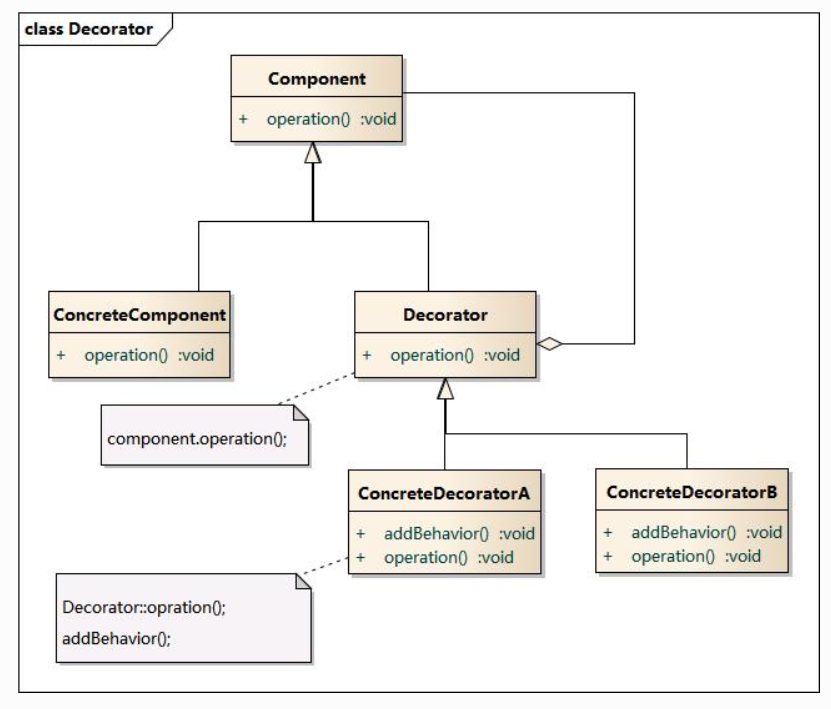

### 特点

1. 动态地给一个对象增加一些额外的功能，比生成子类实现更为灵活；
2. 可以在不需要创造更多子类的情况下，将对象的功能加以扩展；
3. 通过使用不同的具体装饰类以及这些装饰类的排列组合，可以创造出很多不同行为的组合；
4. 具体构件类与具体装饰类可以独立变化；

### 缺点

1. 会产生很多小对象；
2. 比继承更易出错，排错也很困难

### 四个角色

1. 抽象构件类：定义了对象的接口；
2. 具体构件类：被装饰者，实现了在抽象构件中声明的方法；
3. 抽象装饰类：给被装饰者增加功能，具体在其子类中实现，继承抽象构建类以达成类型匹配
4. 具体装饰类：抽象装饰类的子类，负责向构件添加新的功能。

### 适用情况

1. 在不影响其他对象的情况下，以动态、透明的方式给单个对象添加功能；
2. 需要动态地给一个对象增加功能，这些功能也可以动态地被撤销；
3. 当不能采用继承的方式对系统进行扩充或者采用继承不利于系统扩展 和维护时。

## 外观模式

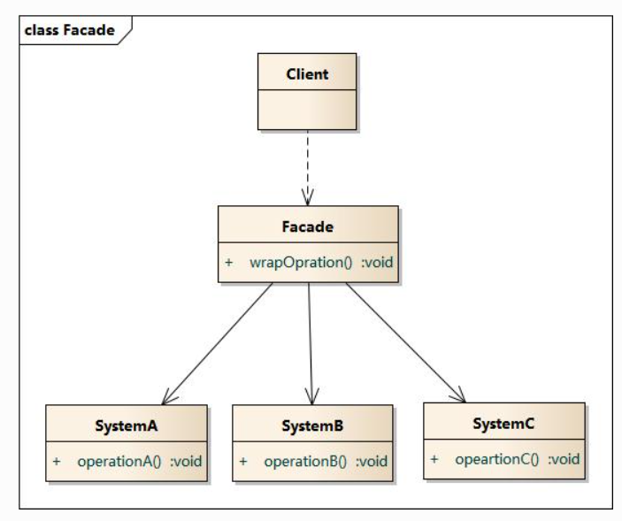

### 特点

1. 将客户端与子系统的内部复杂性分隔开，减少了处理的对象数目，减小使用难度。
2. 通过外观对象调用子系统功能，实现了子系统与客户之间的松耦合关系
3. 降低了大型软件系统中的编译依赖性，简化了系统在不同平台之间的移植过程

### 缺点

1. 不能很好地限制客户使用子系统类
2. 在不引入抽象外观类的情况下，增加新的子系统可能需要修改外观类或客户端的源代码

### 两个角色

1. 外观角色：它知道子系统的功能和责任，将所有客户端的请求委派到相应的子系统处理；
2. 子系统角色：每个子系统可以不是一个单独的类，而是一个类的集合，实现了子系统功能。

### 适用情况

1. 要为一个复杂子系统提供一个简单接口；
2. 客户程序与多个子系统之间存在很大的依赖性；
3. 在层次化结构中，需要定义系统中每一层的入口，使得层与层之间不直接产生联系。

## 享元模式

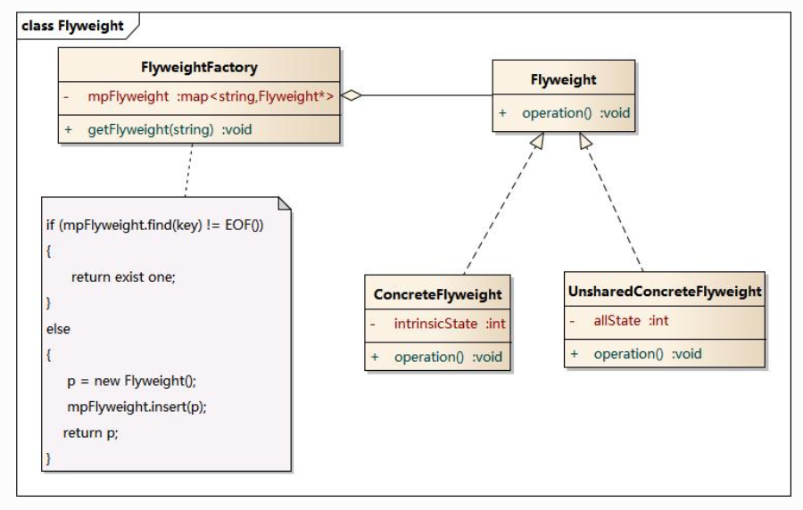

### 特点

1. 以共享的方式高效地支持大量的细粒度对象的复用
2. 它可以极大减少内存中对象的数量，使得相同对象或相似对象在内存中只保存一份
3. 能做到共享的关键是区分内部状态和外部状态
4. 内部状态：存储在享元对象内部并且不会随环境改变而改变的状态，可以共享；
5. 外部状态：随环境改变而改变的、不可以共享的状态。

### 缺点

1. 使得系统更加复杂，
2. 需要将享元对象的状态外部化，而读取外部状态使得运行时间变长。

### 四个角色

1. 抽象享元类：声明一个接口，通过它可以接受并作用于外部状态；
2. 具体享元类：实现了抽象享元接口，其实例称为享元对象；
3. 非共享具体享元类：不能被共享的抽象享元类的子类；
4. 享元工厂类：创建并管理享元对象，将各种类型的具体享元对象存储在一个享元池中。

适用情况

1. 一个系统有大量相同或者相似的对象，造成内存的大量耗费；
2. 对象的大部分状态都可以外部化，可以将这些外部状态传入对象中；

## 代理模式

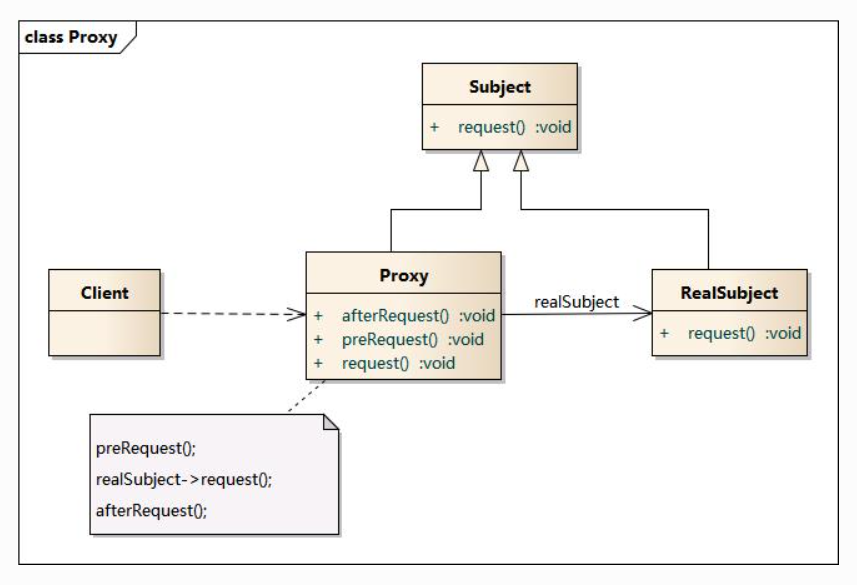

### 特点

1. 给某一个对象提供一个代理，并由代理对象控制对原对象的引用。
2. 能够协调调用者和被调用者，在一定程度上降低了系统的耦合度；

### 三个角色

1. 抽象主题角色：声明了真实主题和代理主题的共同接口；
2. 代理主题角色：内部包含对真实主题的引用，从而可以在任何时候操作真实主题对象；
3. 真实主题角色：定义了代理角色所代表的真实对象，.实现了真实的业务操作。

### 缺点

1. 有些类型的代理模式可能会造成请求的处理速度变慢，
2. 实现代理模式需要额外的工作，有些代理模式的实现非常复杂。

### 常见种类

1. **远程代理**

为一个位于不同的地址空间的对象提供一个本地的代表对象，它使得客户端可以访问在远程机器上的对象，远程机器可能具有更好的计算性能与处理速度，可以快速响应并处理客户端请求。

2. **虚拟代理**

通过使用一个小对象来代表一个大对象，减少系统资源消耗，提高运行速度。如果需要创建一个资源消耗较大的对象，先创建一个消耗相对较小的对象来表示，真实对象只在需要时才会被真正创建

3. **保护代理**

可以控制对一个对象的访问，可以给不同的用户提供不同级别的使用权限。

# 行为型模式

## 命令模式

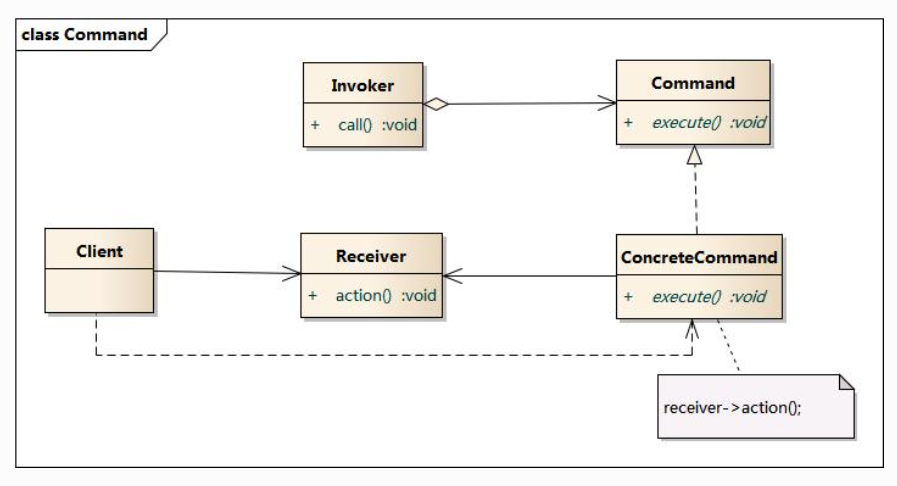

### 特点

1. 本质是对命令进行封装，将发出命令的责任和执行命令的责任分割开。降低系统的耦合度。
2. 使请求本身成为一个对象，这个对象和其他对象一样可以被存储和传递。
3. 增加新的命令很方便；
4. 能够很简单的实现命令队列和宏命令；
5. 能够方便的实现请求的撤销和恢复；

### 缺点

1. 可能会导致某些系统有过多的具体命令类。

### 四个角色

1. 抽象命令类：声明了用于执行请求的方法，通过其可以调用请求接收者的相关操作；
2. 具体命令类：实现了在抽象命令类中声明的方法，将具体接收者对象的动作绑定其中；
3. 调用者（请求者）：它通过命令对象来执行请求；
4. 接收者：执行与请求相关的操作，它具体实现对请求的业务处理。

### 适用情况

1. 需要将请求调用者和请求接收者解耦，使得调用者和接收者不直接交互；
2. 需要在不同的时间指定请求、将请求排队和执行请求；
3. 需要支持命令的撤销操作和恢复操作，
4. 需要将一组操作组合在一起，即支持宏命令。

## 中介者模式

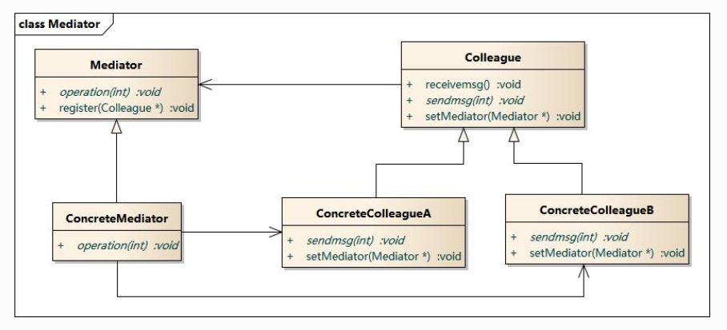

### 特点

1. 用一个中介对象来封装一系列的对象交互，承担中转作用和协调作用。
2. 简化了对象之间的交互，使其耦合松散，且可以独立地改变它们之间的交互。
3. 可以封装多个类的行为，不用产生太多子类。

### 缺点

1. 具体中介者类包含同事类之间的交互细节，可能使其非常复杂，导致系统难以维护。

### 四个角色

1. 抽象中介者：用于定义一个接口，该接口用于与各同事对象之间的通信；
2. 具体中介者：了解并维护各个同事对象的引用，协调各个同事对象来实现协作行为；
3. 抽象同事类：定义各同事的公有方法；
4. 具体同事类：每个同事对象都引用一个中介者对象，通过其间接完成与其他同事类的通信；

### 适用情况

1. 对象之间引用关系复杂，结构混乱且难以理解；
2. 对象引用了其他很多对象且直接和这些对象通信，导致难以复用该对象；
3. 想通过一个中间类来封装多个类中的行为，而又不想生成太多的子类。

## 观察者模式

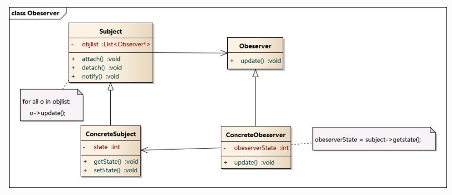

### 特点

1. 对象间的一种一对多依赖关系，
2. 当一个观察目标状态发生改变时，其观察者皆得到通知并被自动更新。
3. 可以实现表示层和数据逻辑层的分离，并在观察目标和观察者之间建立一个抽象的耦合；
4. 支持广播通信；

### 缺点

1. 若观察目标对象有很多直接和间接的观察者，则通知所有观察者会很费时
2. 若观察者和观察目标之间有循环依赖，发生循环调用，可能导致系统崩溃。

### 四个角色

1. 抽象目标：又称为主题，它是指被观察的对象；
2. 具体目标：包含经常发生改变的数据，当其状态发生改变时，向它的各个观察者发出通知；
3. 抽象观察者：将对观察目标的改变做出反应；
4. 具体观察者：维护一个指向具体目标对象的引用，它存储具体观察者的有关状态，这些状态需要和具体目标的状态保持一致。

### 适用情况

1. 一个抽象模型有两个方面，其中一个方面依赖于另一个方面；
2. 一个对象的改变将导致其他若干对象也发生改变，而不知道具体有多少对象将发生改变；
3. 一个对象必须通知其他对象，而并不知道这些对象是谁；
4. 需要在系统中创建一个触发链。

## 状态模式

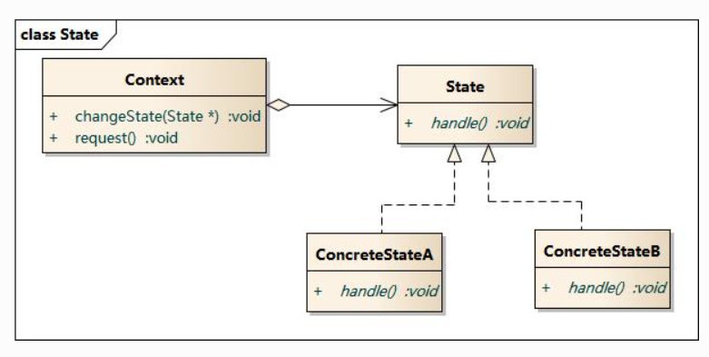

### 特点

1. 描述了对象状态的变化以及对象在不同状态下的不同行为。
2. 枚举可能的状态，并封装了转换规则
3. 将所有与某个状态有关的行为放到一个状态类中，改变对象状态即可改变对象的行为；
4. 可以方便地增加新的状态。

### 三个角色

1. 环境类（上下文类）：是拥有状态的对象，维护一个抽象状态类的实例，表示当前状态；
2. 抽象状态类：用于定义一个接口以封装与环境类的一个特定状态相关的行为；
3. 具体状态类：实现一个与环境类某个状态相关的行为，行为互不相同

### 缺点

1. 会增加系统类和对象的个数，
2. 结构与实现都较为复杂，使用不当将导致程序结构和代码的混乱，
3. 对于可以切换状态的状态模式不满足“开闭原则”的要求。

### 适用情况

1. 对象的行为依赖于它的状态（属性）并且可以根据它的状态改变而改变它的相关行为；
2. 代码中包含大量与对象状态有关的条件语句，导致可维护性和灵活性变差

## 策略模式

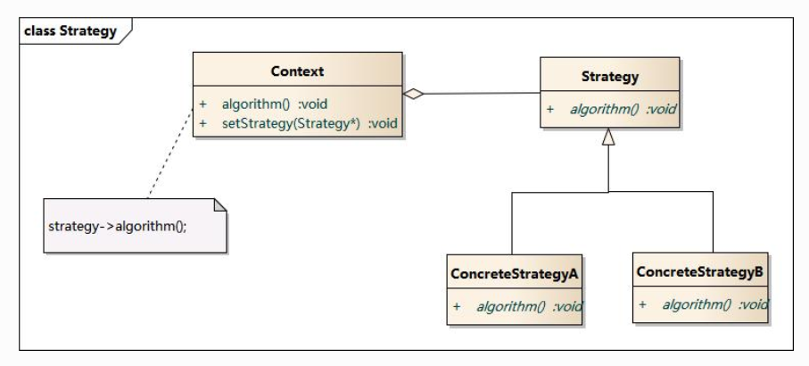

### 特点

1. 将不同的处理逻辑（策略）单独封装起来，且允许它们相互替换。
2. 在不修改原有系统的基础上可以更换或增加新的策略，提高了代码的复用性，
3. 符合“开闭原则”，是一种替换继承，避免多重条件转移语句的实现方式；

### 三个角色

1. 环境类：在解决某个问题时可以采用多种策略，维护一个对抽象策略类的引用实例；
2. 抽象策略类：为所支持的处理逻辑声明了抽象接口；
3. 具体策略类：实现了在抽象策略类中定义的算法。

### 缺点

1. 客户端必须知道所有的策略类，并理解其区别，
2. 在一定程度上增加了系统中类的个数，可能会存在很多策略类。

### 适用情况

1. 系统里许多类之间的区别仅在于其行为，策略模式可以让对象动态地选择一种行为；
2. 一个系统需要策略地在几种算法中选择一种；
3. 避免使用难以维护的多重条件选择语句；
4. 希望在具体策略类中封装算法和与相关的数据结构。